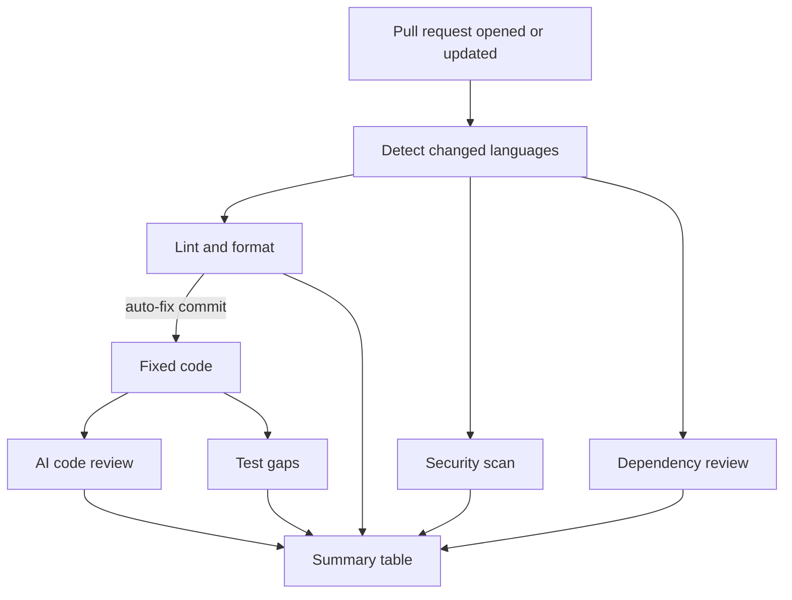
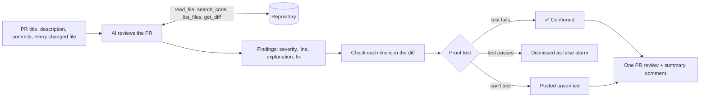
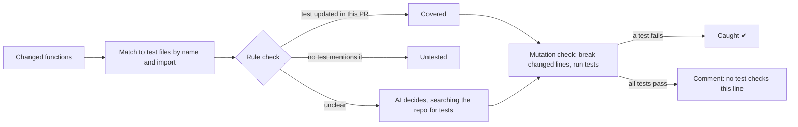
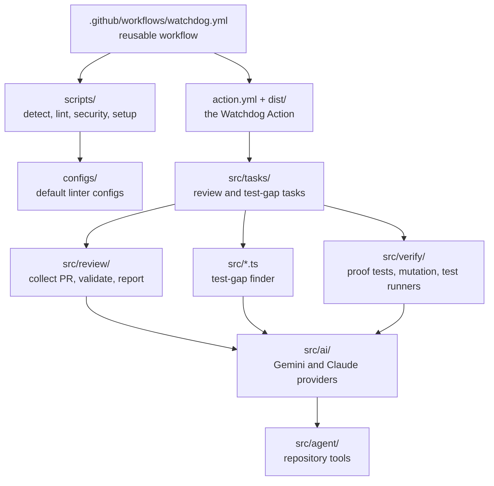

# 🐕 Watchdog

Watchdog is a plug-and-play GitHub pull request checker for JavaScript/TypeScript, Python, Java, C++ and SQL. It lints and auto-formats your code, scans for security problems, reviews the whole PR with AI, and finds changes that no test covers.

Unlike most AI reviewers, Watchdog **checks its claims by running your tests**. Suspected bugs are proven with a failing test, and false alarms are thrown away.

## Features

- **Multi-language linting and formatting**: ESLint, Prettier, Flake8, Black, Checkstyle, clang-tidy, SQLFluff and more, on changed files only. Fixes are committed back to the PR automatically.
- **Security scanning**: CodeQL, Bandit, pip-audit, npm audit and GitHub's dependency review.
- **AI code review of the whole PR**: the AI reads every changed file plus the code around it (callers, helpers, tests), then posts inline comments with one-click fixes and a 1–10 score.
- **Proof tests**: for each suspected bug, Watchdog writes a test and runs it. A failing test means the bug is **confirmed**; a passing one means it was a false alarm.
- **Mutation check**: Watchdog makes small deliberate breaks to changed lines (like `>` → `>=`) and runs the tests. If nothing fails, no test really checks that line.
- **Test-gap finder**: flags functions whose logic changed without a matching test.
- **Free to run**: uses Google Gemini's free tier by default, or Claude if you prefer.
- **One summary**: every check's result in a single table.

## Tech Stack

| Area                               | Tools                                                  |
| ---------------------------------- | ------------------------------------------------------ |
| Automation                         | GitHub Actions (reusable workflow), Bash               |
| Watchdog itself                    | TypeScript, Node.js, Zod, Vitest, esbuild              |
| AI                                 | Google Gemini (free tier, default) or Anthropic Claude |
| JavaScript / TypeScript            | ESLint, Prettier, `tsc`                                |
| Python                             | Flake8, Black, isort, mypy, Bandit, pip-audit          |
| Java                               | Checkstyle, google-java-format                         |
| C / C++                            | clang-tidy, clang-format                               |
| SQL                                | SQLFluff                                               |
| Security                           | CodeQL, npm audit, Dependency Review                   |
| Test runners (proofs and mutation) | Vitest, Jest, pytest                                   |

## Architecture

### 1. The pipeline

Every pull request runs through these jobs. Lint, security and dependency review run in parallel. The AI review and test-gap jobs wait for auto-fix, so their comments land on the fixed code.



### 2. AI code review

The AI gets the whole PR, then explores the repository with read-only tools before reporting anything. Each finding is checked against the diff, and suspected bugs are proven with a test.



### 3. Test gaps and the mutation check



### 4. How the code is organized



## Quick Start

### 1. Add the workflow

Create `.github/workflows/watchdog.yml` in your repository:

```yaml
name: Watchdog
on:
  pull_request:
    types: [opened, synchronize, reopened]
permissions:
  contents: write
  pull-requests: write
  security-events: write
  actions: read
jobs:
  watchdog:
    uses: shivaniparimi/watchdog/.github/workflows/watchdog.yml@main
    secrets: inherit
```

### 2. Add a free AI key (optional)

Create a free Gemini key at [aistudio.google.com/apikey](https://aistudio.google.com/apikey). It only needs a Google account, no credit card. Add it under **Settings → Secrets and variables → Actions** as `GEMINI_API_KEY`.

To use Claude instead, add `ANTHROPIC_API_KEY`. Without any key, everything except the AI features still runs.

### 3. Open a pull request

Watchdog runs automatically and comments on the PR.

## Configuration

Watchdog works without any configuration. If your repo has its own linter configs (`eslint.config.js`, `.prettierrc`, `.flake8`, `pyproject.toml`, `.clang-format`, `.sqlfluff`…), Watchdog uses them; otherwise it uses the defaults in [`configs/`](configs/).

Common options go under `with:` in the workflow:

| Option             | Default | What it does                                            |
| ------------------ | ------- | ------------------------------------------------------- |
| `auto-fix`         | `true`  | Commit formatting fixes back to the PR                  |
| `ai-review`        | `true`  | Run the AI code review                                  |
| `verify-findings`  | `true`  | Prove suspected bugs with a test                        |
| `mutation-testing` | `true`  | Run the mutation check                                  |
| `test-gap`         | `true`  | Run the test-gap finder                                 |
| `codeql`           | `true`  | Run CodeQL                                              |
| `ai-provider`      | `auto`  | `gemini`, `anthropic`, or `auto` (whichever key is set) |
| `min-severity`     | `minor` | Lowest AI finding severity posted as a comment          |
| `fail-on-severity` | `none`  | Fail the check on AI findings this severe               |
| `setup-command`    | auto    | How to install your project so its tests can run        |
| `ignore-paths`     | none    | Files for the AI to skip                                |

All options are listed in [`.github/workflows/watchdog.yml`](.github/workflows/watchdog.yml).

### Supported files

| Language                | Extensions                  | Format             | Lint         | Proofs and mutation |
| ----------------------- | --------------------------- | ------------------ | ------------ | ------------------- |
| JavaScript / TypeScript | `.js` `.jsx` `.ts` `.tsx`   | Prettier           | ESLint, tsc  | Vitest, Jest        |
| Python                  | `.py`                       | Black, isort       | Flake8, mypy | pytest              |
| Java                    | `.java`                     | google-java-format | Checkstyle   | —                   |
| C / C++                 | `.c` `.cpp` `.h` `.hpp`     | clang-format       | clang-tidy   | —                   |
| SQL                     | `.sql`                      | SQLFluff           | SQLFluff     | —                   |
| Styles, data, docs      | `.css` `.json` `.yml` `.md` | Prettier           | —            | —                   |

## Project Structure

```
watchdog/
├── .github/workflows/
│   ├── watchdog.yml        # The pipeline other repos use
│   └── ci.yml              # Watchdog's own tests
├── action.yml              # The Watchdog Action (AI review and test gaps)
├── dist/index.cjs          # Built Action (generated by npm run build)
├── scripts/
│   ├── detect.sh           # Sort changed files by language
│   ├── lint.sh             # Run linters and formatters (check or fix)
│   ├── security.sh         # npm audit, pip-audit, Bandit
│   ├── setup-project.sh    # Install a repo's dependencies to run its tests
│   └── install-hook.sh     # Optional pre-commit hook
├── configs/                # Default linter configs
├── src/
│   ├── ai/                 # Gemini and Claude providers
│   ├── agent/              # Read-only repository tools for the AI
│   ├── review/             # AI code review
│   ├── verify/             # Proof tests, mutation check, test runners
│   ├── tasks/              # Action entry points
│   ├── *.ts                # Test-gap finder
│   └── local.ts            # Run Watchdog locally
└── test/                   # Unit tests
```

## Run it locally

```bash
git clone https://github.com/shivaniparimi/watchdog && cd watchdog && npm install

# AI review of another repo's changes vs. main (prints results, posts nothing)
GEMINI_API_KEY=... npm run local -- --task review --repo ../my-project --verify

# Test gaps and the mutation check (no AI needed)
npm run local -- --task test-gap --repo ../my-project --no-ai --mutate

# Pre-commit hook that auto-formats staged files
scripts/install-hook.sh ../my-project
```

To work on Watchdog itself: `npm test`, `npm run typecheck`, and `npm run build` (commit `dist/` afterward).

## Good to know

- **Free tier limits**: Gemini's free tier allows about 20 requests per model per day, and one run can use 10–20. Watchdog switches to another free model when one runs out, and posts a note instead of failing if all are used up. Use a key just for Watchdog.
- **Privacy**: on the free tier, [Google may use what you send to improve its products](https://ai.google.dev/gemini-api/terms). For private code, use a paid key or Claude.
- **Safety**: tests run with all tokens and keys removed from their environment, and proof tests are deleted after running. Fork PRs never get your secrets.
- **Fork PRs** are checked but not auto-fixed, since GitHub doesn't allow pushing to forks.
- **Auto-fix commits** made with the default token need someone to approve the next run. Add a `WATCHDOG_PUSH_TOKEN` secret to skip that.
- **Dependency review** needs the dependency graph turned on (Settings → Code security).
